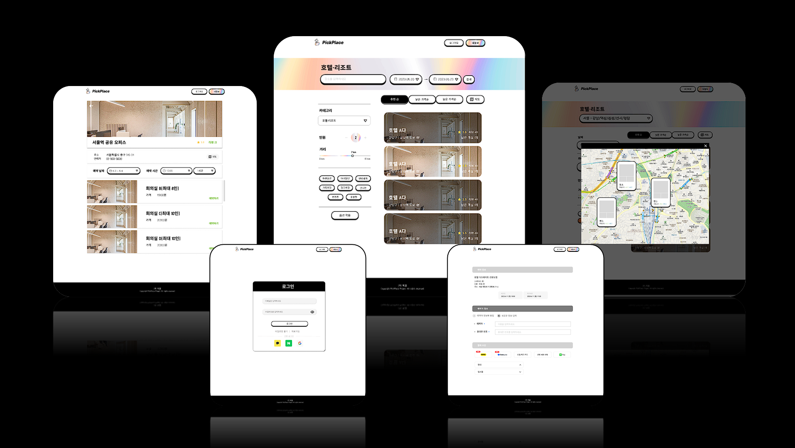

# pickplace-client
⚛ PICK-PLACE(픽플) : 원하는 공간을 실시간 추천/예약 서비스

 

## 서비스 설명

사용자의 취향에 맞게 장소/공간을 예약, 추천해주는 웹사이트

- 최소 기능 (MVP)
  - 인증 권한 : 일반로그인, 소셜로그인(카카오), 회원가입(메일링 이메일 인증), 토큰재발급(JWT)
   
  - 태그를 이용해서 내가 관심있는 공간에 대해 한눈에 볼 수 있게 표시 & 추천
    - `애견동반` `한적함` `익사이팅` `연인추천` `오션뷰`

  - 카테고리별, 키워드별 검색
  
  - 원하는 공간에 대해 예약 신청 & 수락/거절 기능

  - 평점 및 리뷰 기능

  - 현재 위치, 지정 위치 기준 장소 추천 서비스 + 맵 연동

  - 사장님 공간 등록/수정/변경 조회

  - 공간별 예약 조회/수락/거절

  - 예약/결제 기능
      - 카드결제
      - 간편 계좌 이체
      - QR 결제 (카카오페이, 토스페이, 네이버페이)

- OUT OF SCOPE
  - SNS 장소 공유
  - 예약 변경

 

## 공통 컨벤션 (Convention)

### 🌴 Branch 전략 
- Git Flow

|  **항목**  |                                  **설명**                                   |
| ---------- | --------------------------------------------------------------------------- |
| main       | 기준이 되는 브랜치로 제품을 배포하는 브랜치                                  |
| develop    | 개발 브랜치로 개발자들이 이 브랜치를 기준으로 각자 작업한 기능들을 Merge      |
| feature    | 단위 기능을 개발하는 브랜치로 기능 개발이 완료되면 develop 브랜치에 Merge     |
| release    | 배포를 위해 main 브랜치로 보내기 전에 먼저 QA(품질검사)를 하기위한 브랜치     |
| hotfix     | master 브랜치로 배포를 했는데 버그가 생겼을 떄 긴급 수정하는 브랜치           |

- Git Flow 과정
  - master 브랜치에서 develop 브랜치를 분기함
  - 개발자들은 develop 브랜치에 자유롭게 커밋을 함
  - 기능 구현이 있는 경우 develop 브랜치에서 feature/* 브랜치를 분기합니다.
  - 배포를 준비하기 위해 develop 브랜치에서 release/* 브랜치를 분기합니다.
  - 테스트를 진행하면서 발생하는 버그 수정은 release/* 브랜치에 직접 반영합니다.
  - 테스트가 완료되면 release 브랜치를 master와 develop에 merge함

- 보통 `main <- release <- develop(default) <- feature`
  - 모든 기능 구현은 `feature`을 이용해 브랜치를 분기해 개발 후 `devleop`으로 pull-request 하기!
  - 직접 `develop`으로 push ❌❌
- 예시 : `feature/login` 

### 🍕 Commit 전략 

|  **항목**  |             **설명**              |
| ---------- | ---------------------------------- |
| ADD        | (새로운) 기능 추가                 |
| UPDATE     | 기능 수정 or  코드 리팩토링        |
| BUGFIX     | 버그 or 이슈 수정                  |

- 타입은 태그와 제목으로 구성되고, 태그는 영어로 쓰되 첫 문자는 대문자로 함
- 태그 : 제목의 형태이며, :뒤에만 space가 있음에 유의함
- 예시 : `git commit -m "[ADD] : header feature implement"`
  - 추가 본문 메시지를 쓸 경우에도 메인 제목은 위와 같이 동일하게 작성

### 🍭 PR 전략
- PR Template에 따름

 

## Frontend

### ✨ 기술 설명
React, TypeScript 를 이용해 Front-end 개발

### 🔥 기술 스택
> 사용 SPA 라이브러리 : React

|  **항목**  |  **기술 스택**                   |
| ---------- | -------------------------------- |
| 환경세팅   | React CRA                         |
| 사용언어   | TypeScript                        |
| 스타일링   | CSS, SCSS                         |
| 상태관리   | Redux, Redux-Thunk, Redux-Toolkit |
| 코드통합   | Prettier                          |
| 에러검출   | Eslint                            |
| API 통신   | Axios                             |
| 빌드패키지 | **yarn-berry**                    |

### 🔅 코드 컨벤션
|  **항목**  |    **규칙**      |
| ---------- | ---------------- |
| Directory  | camelCase        |
| File       | PascalCase       |
| Constant   | UPPER_SNAKE_CASE       |
| Variable   | camelCase        |
| Function   | camelCase        |

### ✔ 추가 라이브러리 & 버전 정보

|  **항목**  |  **버전 정보**    |
| ---------- | ------------------ |
| Yarn       |  v3.6.0            | 
| Node       |  v18.14.2          |
| React      |  v18.2.0           |
| Redux      |  v4.2.1            |
| Axios      |  v1.4.0            |
| Sass       |  v1.62.1           |

 

---

🔗 [PICK-PLACE(픽플)](https://pickplace.site/)
